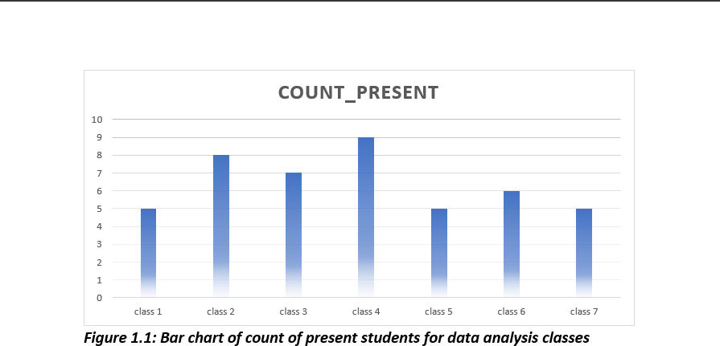
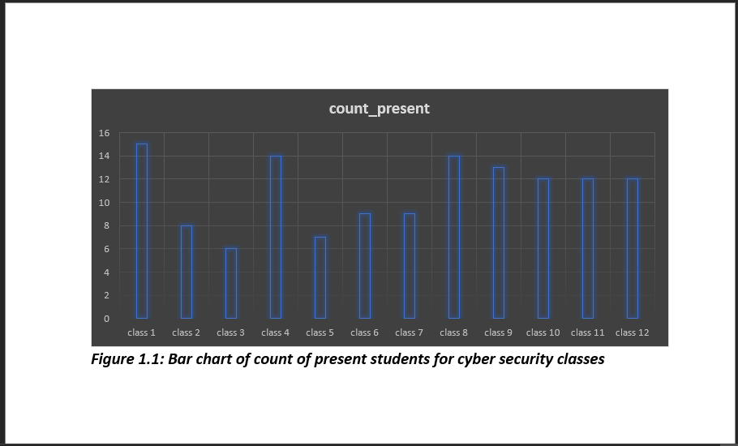
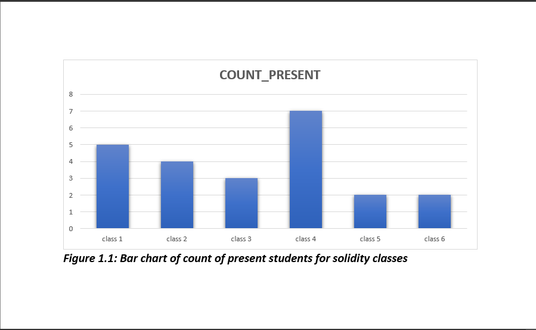

# Cipher Session Analysis

## INTRODUCTION:
This project was an analysis carried out on a cipher session.
Courses offered during this session include:
-	Data Analysis
-	Web design and Development
-	UI/UX
-	Solidity
-	Cyber security 

## PROBLEM STATEMENT:
- How successful was the session
-  How can future session be more outstanding 

##  DATA SOURCING:
-	Primary data (Attendance sheet, registration forms etc)
-	Secondary data (Gotten from session attendees)

## DATA CLEANING:
-	The removal of null values
-	The removal of irrelevant responses etc.

## SKILL/CONCEPT: 
-	Data sourcing 
-	Statistical analysis
-	Data analysis 

## _Disclaimer_: 
  _It is important to note the limitations of this report most of which are data related some of these limitations include:_
-	 Data used are not all encompassing of previous cipher sessions attendees 
-	Inability to get opinions/response from some previous attendees
- Inability to reach some set of previous attendees etc.

## VISUALIZATIONS
_____

______

____

_____

_____

## ANALYSIS:
-	Number of forms links sent out: 100

-	Number of responses gotten: 30

a.	Data analysis = 3

b.	WDD = 6

c.	Solidity = 1

d.	Cyber security = 13

e.	UI/UX = 5

-	Number of persons who completed their session (having a certificate was the criterium) = 5

-	Number of persons who didn’t complete their sessions (that is no certificate) = 23

-	Most common reasons for not completing the session = Gadget/Device related problems, unfavourable class schedule time.

-	Most recommendations for future cipher sessions = More certificate being issued out, equal attention to both physical and online students, use of more organized learning platform (example slack)

-	Most comments about Tutors = ‘very helpful’, ‘Tutor Josh is the best’, ’Tutor Ebube is an excellent tutor’, ’Tutor primidac was hard on us which pushed us to our limit’.

-	Most comments on the most interesting part of the session = interactive question and answer session, the hackathon, research assignments.

-	Number of persons who would recommend Borderless Cipher sessions to anyone = 25 (83%)

## 	CONCLUSION:
While we were not able to reach majority of previous cipher session attendees valuable insights can still be drawn from the results presented above. Some of these include:
-	The need to give out more certificate of completion to students who meet the criteria
-	Applaud and encourage more interactive and engaging activities during sessions
-	The need to look into class time scheduling etc.

