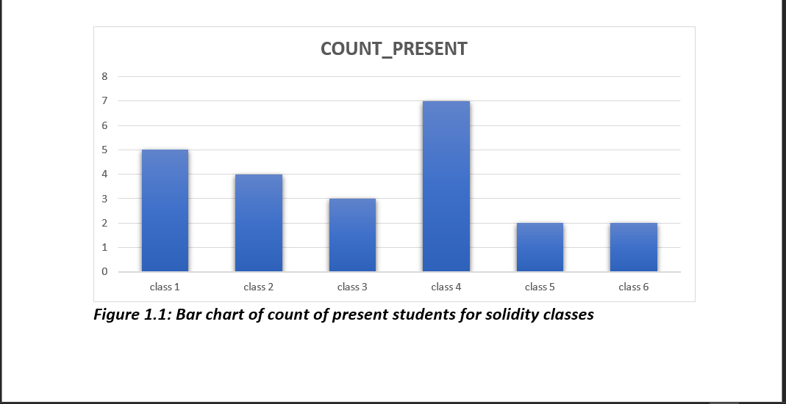

# Cipher Session Analysis

## INTRODUCTION:
This project was an analysis carried out on a cipher session.
Courses offered during this session include:
-	Data Analysis
-	Web design and Development
-	UI/UX
-	Solidity
-	Cyber security 

## PROBLEM STATEMENT:
- How successful was the session
-  How can future session be more outstanding 

##  DATA SOURCING:
-	Primary data (Attendance sheet, registration forms etc)
-	Secondary data (Gotten from session attendees)

## DATA CLEANING:
-	The removal of null values
-	The removal of irrelevant responses etc.

## SKILL/CONCEPT: 
-	Data sourcing 
-	Statistical analysis
-	Data analysis 

## _Disclaimer_: 
  _It is important to note the limitations of this report most of which are data related some of these limitations include:_
-	 Data used are not all encompassing of previous cipher sessions attendees 
-	Inability to get opinions/response from some previous attendees
- Inability to reach some set of previous attendees etc.

## VISUALIZATIONS

## Project Overview
The file above contains detailed written report of the analysis carried out on a particular cipher session.

